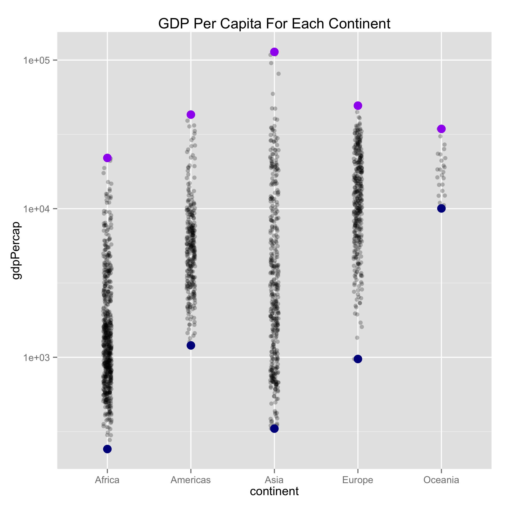
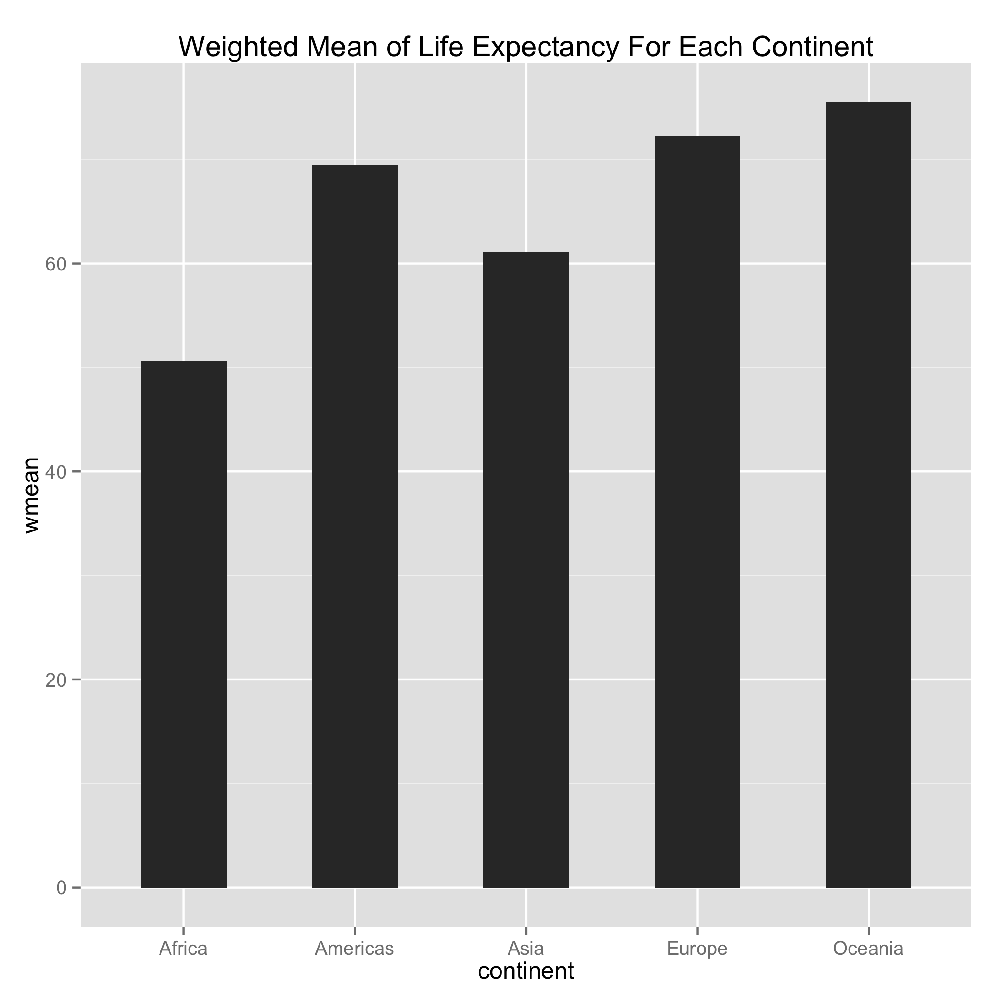
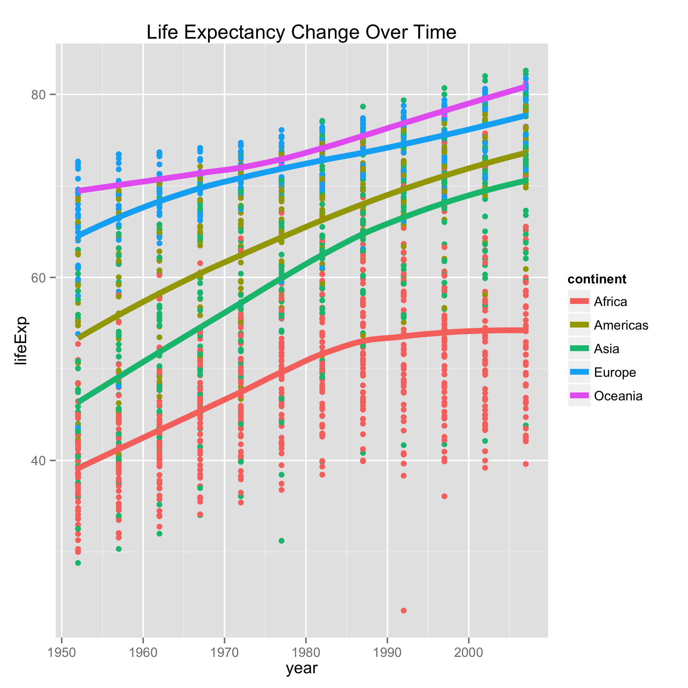
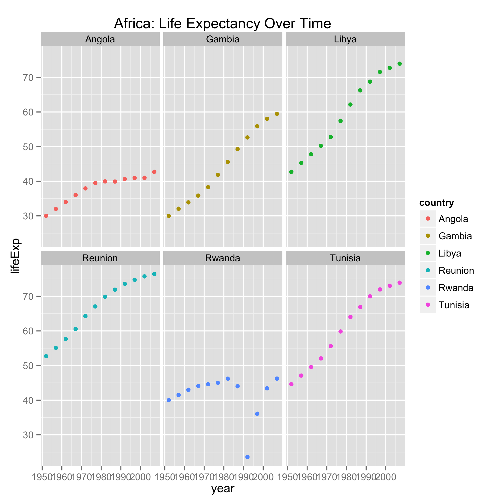
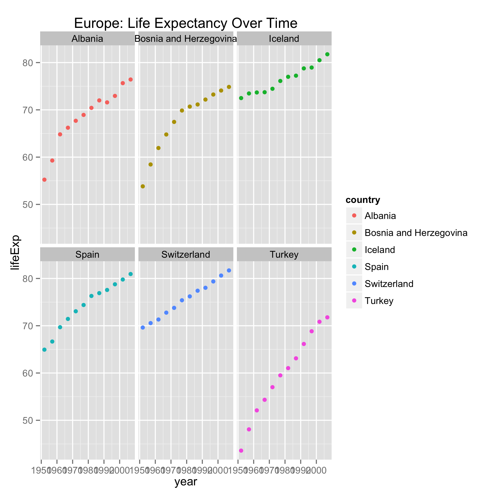
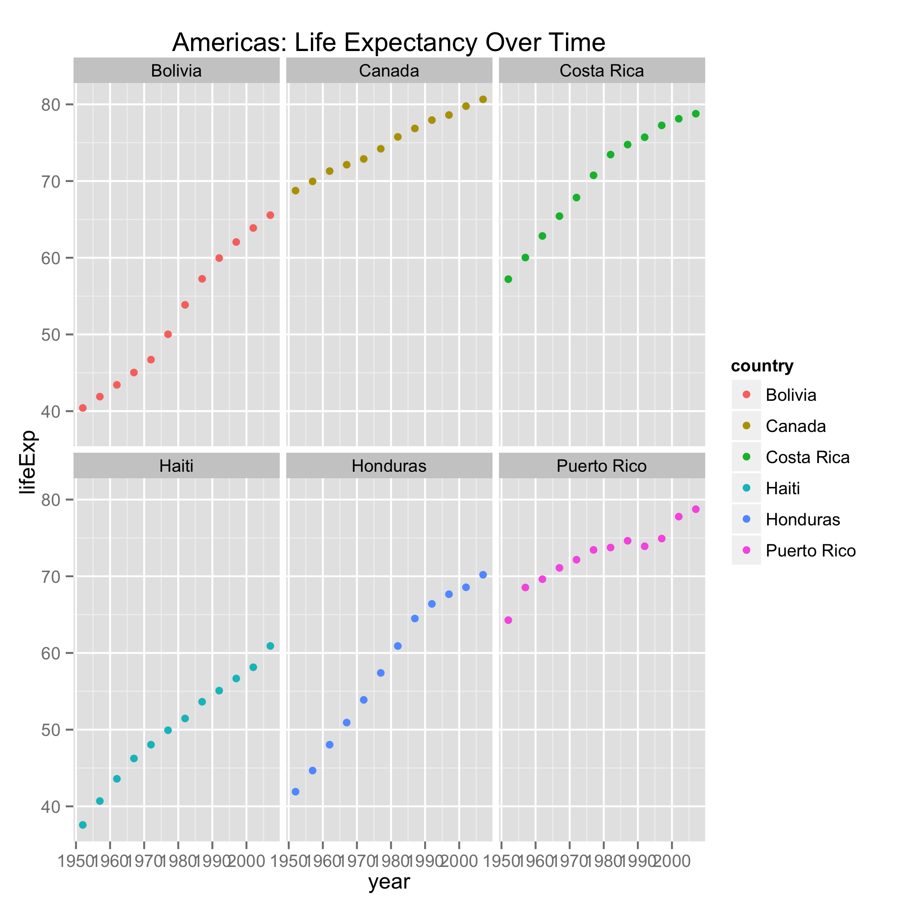

This is the report file for my Makefile Homework 9 for STAT547. In this homework, I perform exploratory data analyses and statistical analyses on the gapminder dataset. 

I created eight plots: life expectancy versus GDP per capita in each country, GDP per capita on each continent, the weighted mean of life expectancy for each continent, life expectancy change over time, life expectancy change over time for six countries in Africa, life expectancy change over time for six countries in Asia, life expectancy change over time for six countries in Europe, and life expectancy change over time for six countries in Europe. 

```{r}
library(ggplot2)
suppressPackageStartupMessages(library(dplyr))
library(broom)
```

```{r}
cat(file = "gapminder.tsv", RCurl::getURL("https://raw.githubusercontent.com/jennybc/gapminder/master/inst/gapminder.tsv"))
gapminderdf <- read.delim("gapminderdf.tsv")
gapminderdf_maxlifeExp <- read.delim("gapminderdf_maxlifeExp.tsv")
newgapminderdf <- read.delim("newgapminderdf.tsv")
allcountries <- read.delim("allcountries.tsv")
selectedcountriesdf <- read.delim("selectedcountriesdf.tsv")
```













