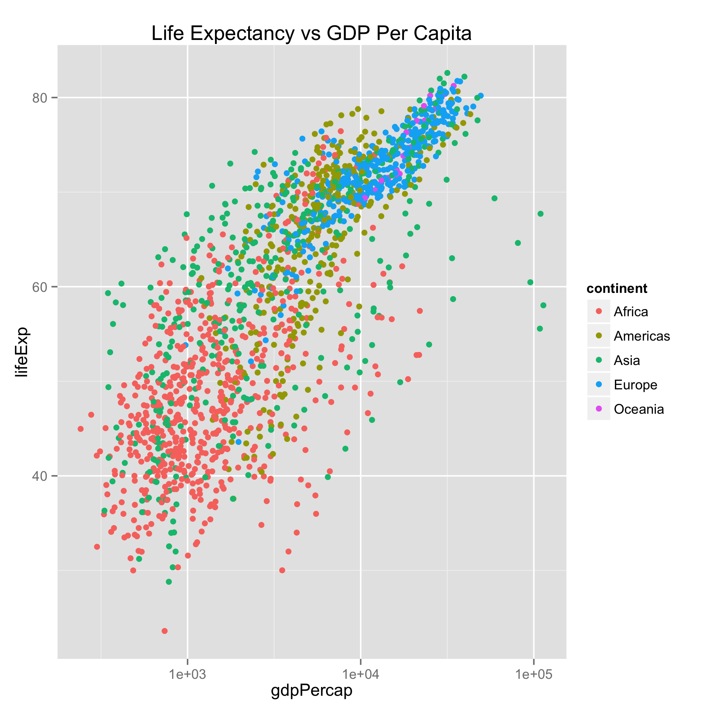
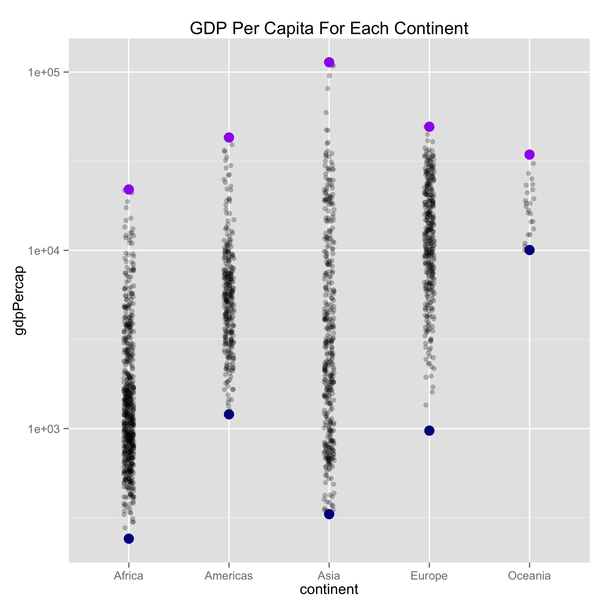
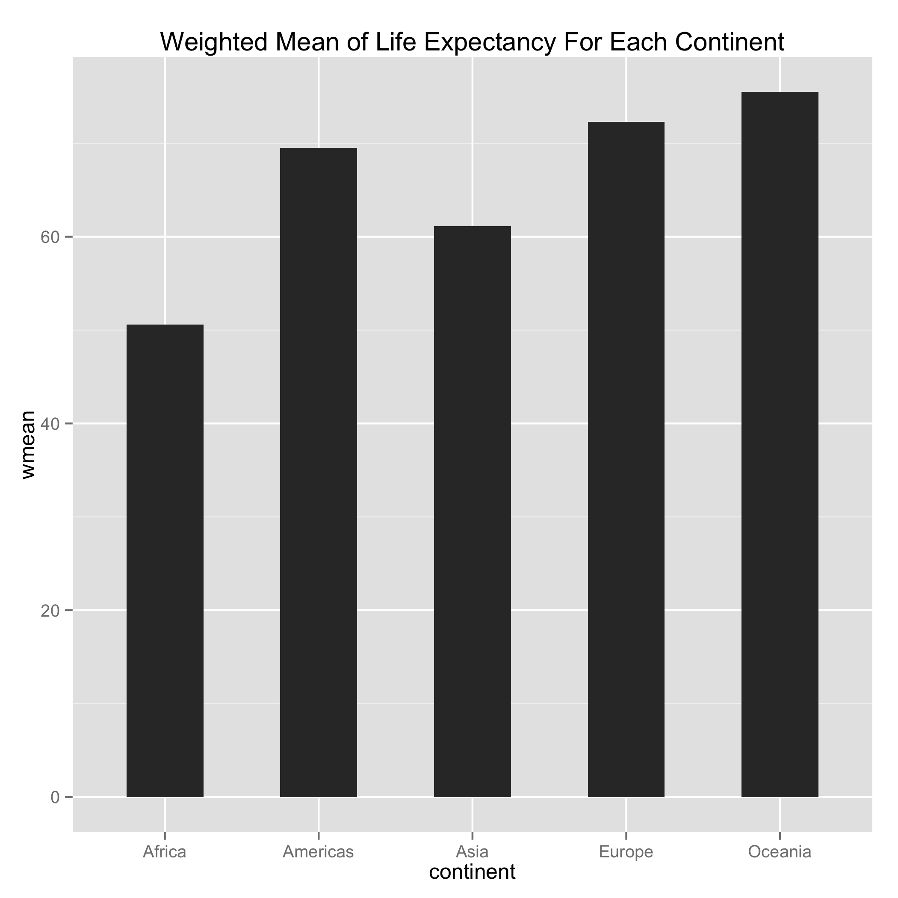
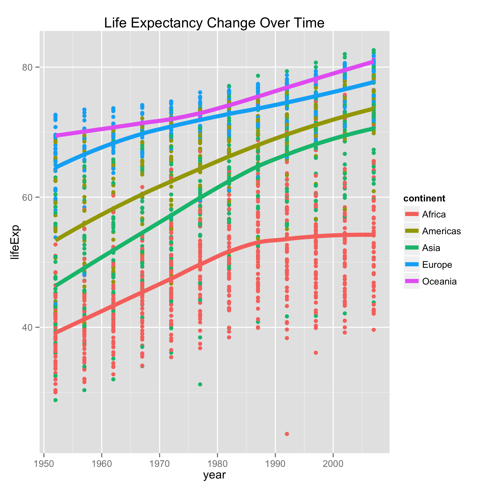
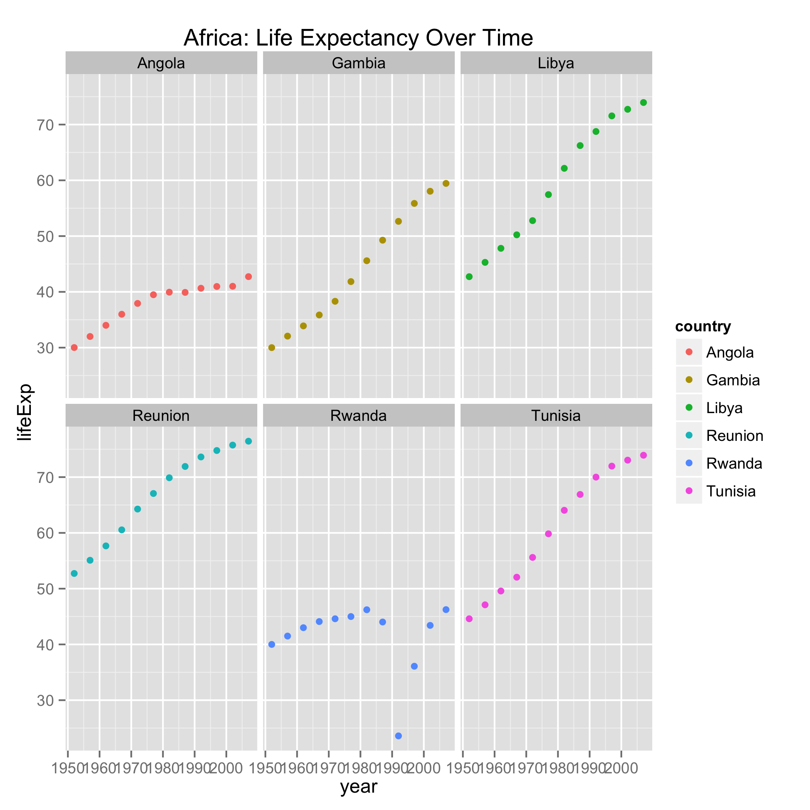
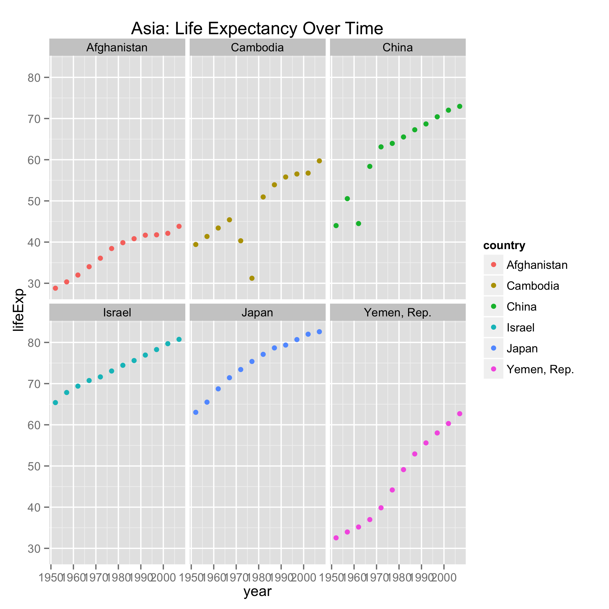
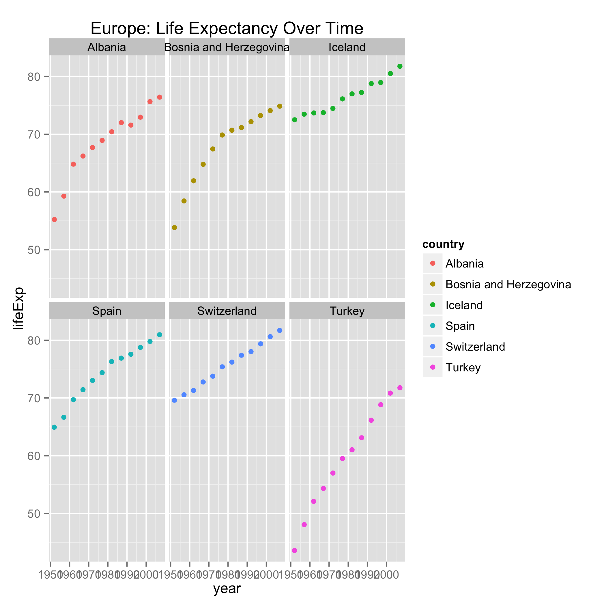
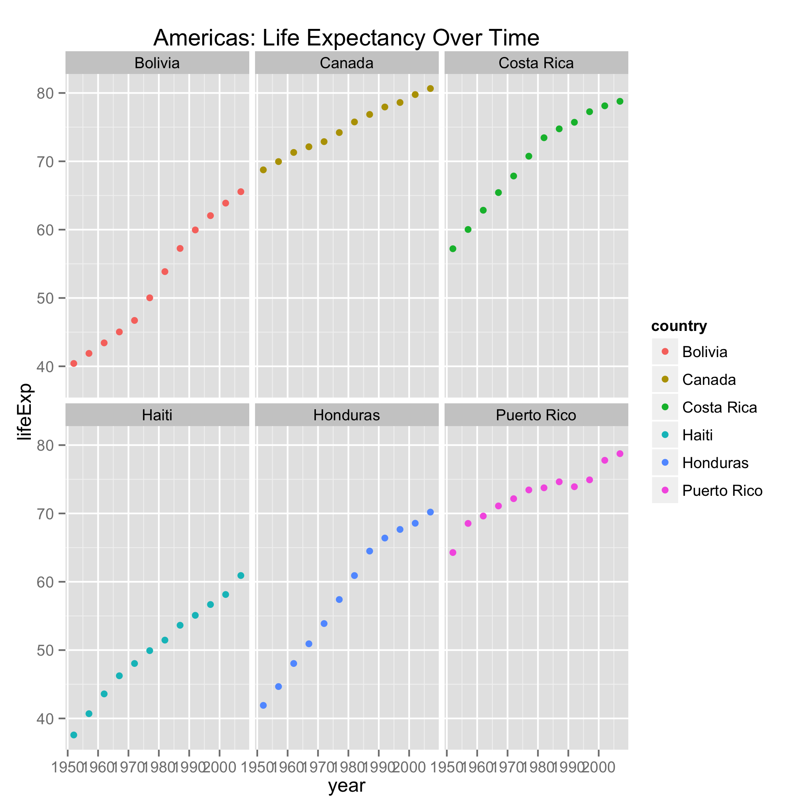

# MakefileMarkdown
Mollie  
November 26, 2015  

I downloaded the gapminder dataset from the internet and wrote it as a dataframe. Next, I reordered the continents by maximum life expectancy and wrote that table into another dataframe.

LifeExpVsGDPpercap.png GDPpercapVsContinent.png LifeExpWeightedMean.png LifeExpVsYear.png africa.png asia.png europe.png americas.png


```r
library(ggplot2)
```

```
## Loading required package: methods
```

```r
suppressPackageStartupMessages(library(dplyr))
library(broom)
```


```r
cat(file = "gapminder.tsv", RCurl::getURL("https://raw.githubusercontent.com/jennybc/gapminder/master/inst/gapminder.tsv"))
gapminderdf <- read.delim("gapminderdf.tsv")
gapminderdf_maxlifeExp <- read.delim("gapminderdf_maxlifeExp.tsv")
newgapminderdf <- read.delim("newgapminderdf.tsv")
allcountries <- read.delim("allcountries.tsv")
selectedcountriesdf <- read.delim("selectedcountriesdf.tsv")
```

I created four plots: life expectancy versus GDP per capita in each country, GDP per capita on each continent, the weighted mean of life expectancy for each continent, and life expectancy change over time. 
















